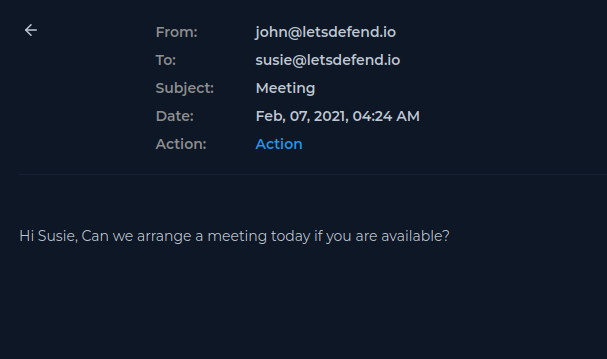
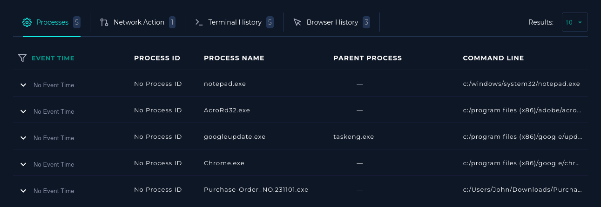
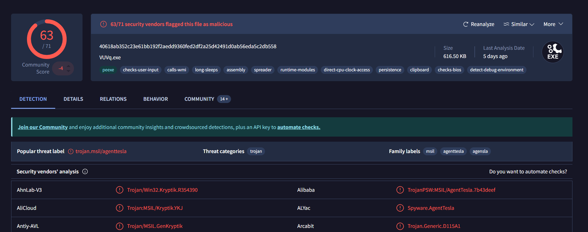

# Incident Report: SOC120 - Phishing Mail Detected - Internal to Internal

## 1. Alert Overview
* **Event ID:** 52
* **Rule:** SOC120 - Phishing Mail Detected - Internal to Internal
* **Severity:** Medium
* **Event Time:** Feb, 07, 2021, 04:24 AM
* **Device Action:** Allowed
* **Level:** Security Analyst

## 2. Email Analysis
* **Sender:** john@letsdefend.io
* **Sender IP:** 172.16.17.82
* **Recipient:** susie@letsdefend.io
* **SMTP Address:** 172.16.20.3
* **Subject:** Meeting
* **Attachments:** None

**Email Body:**
 \
*Figure 1: Suspicious Email from John to Susie*

**Analysis Findings:**
* **Suspicious Indicators:** The email contains a generic greeting, awkward phrasing, and lacks essential details about the meeting (intent, topic, duration).
* **Timing Anomaly:** The message was delivered at 04:24 AM, which is significantly outside of standard business hours.

## 3. Endpoint Investigation (John's Machine)
* **IP Address:** 172.16.17.82
* **Process Analysis:**
  * Legitimate processes observed running: `notepad.exe`, `AcroRd32.exe`, `googleupdate.exe`, `chrome.exe`.
  * **Suspicious File Executed:** `Purchase-Order_NO.231101.exe`
     \
    *Figure 2: Malicious Process Execution Log*

  * **File Location:** `c:/Users/John/Downloads/Purchase-Order_NO.231101.exe`
  * **Threat Identification:** Identified as **Trojan.MSIL/AgentTesla**.
  * **VirusTotal Intelligence:** [View VT Report](https://www.virustotal.com/gui/file/40618ab352c23e61bb192f2aedd9360fed2df2a25d42491d0ab56eda5c2db558)
     \
    *Figure 3: VirusTotal Detection Results*

## 4. Command History Analysis
The following commands were observed executing on John's machine, indicating unauthorized system interaction:
* `dir`
* `dir /s`
* `users`
* `net user`
* `ping raw.githubusercontent.com`

**Findings:**
* System enumeration and directory traversal activity is present.
* External connectivity tests were performed.
* The behavior is highly consistent with post-compromise reconnaissance executed by an attacker or automated malware script.

## 5. Impact Assessment
**AgentTesla** is a notorious and advanced information-stealing malware. Its capabilities include:
* Stealing browser credentials and session cookies.
* Extracting email client credentials.
* Capturing keystrokes (Keylogging).
* Exfiltrating sensitive data to external Command & Control (C2) servers.

## 6. Attack Summary (Final Chain)
1. The user (John) downloaded and executed a disguised malicious file (`Purchase-Order_NO.231101.exe`).
2. The AgentTesla malware was successfully installed on the system.
3. System reconnaissance and enumeration commands were executed to map the compromised host.
4. Potential data theft and external communication with attacker infrastructure were initiated.
5. The compromised account was subsequently used to send an anomalous internal email, triggering the SOC alert.

## 7. Conclusion & Final Verdict
**Conclusion:** The system (John's machine) is confirmed to be compromised by AgentTesla malware following the execution of a malicious executable originating from the Downloads folder. The activity observed on the endpoint strongly aligns with post-exploitation behavior, encompassing system reconnaissance and potential data exfiltration. 

**Final Verdict:** **False Positive – Not a Phishing Mail**
*(Analytical Note: While the alert triggered for a phishing email, the mail itself lacked traditional phishing payloads such as malicious attachments or credential-harvesting links. Instead, the email was an anomalous byproduct of an already compromised endpoint. The alert is a False Positive for inbound phishing, but serves as a True Positive indicator of an internal host compromise).*
