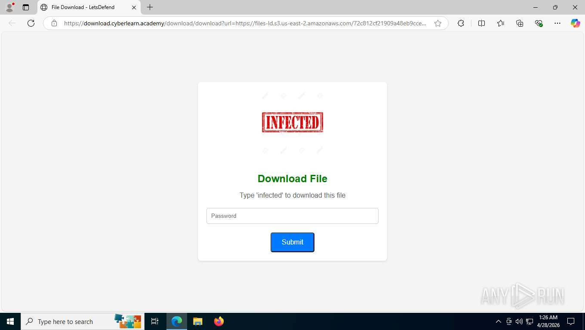
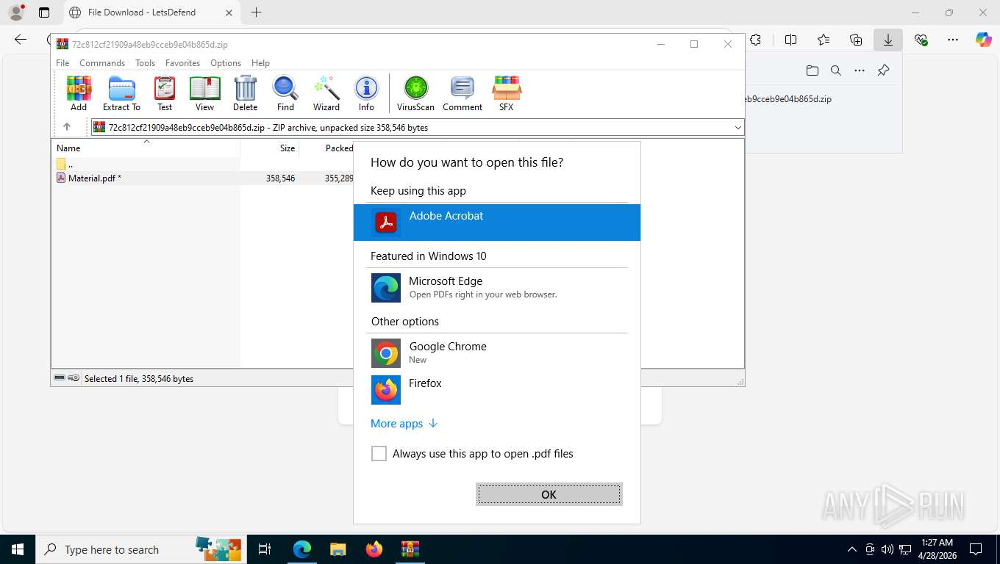
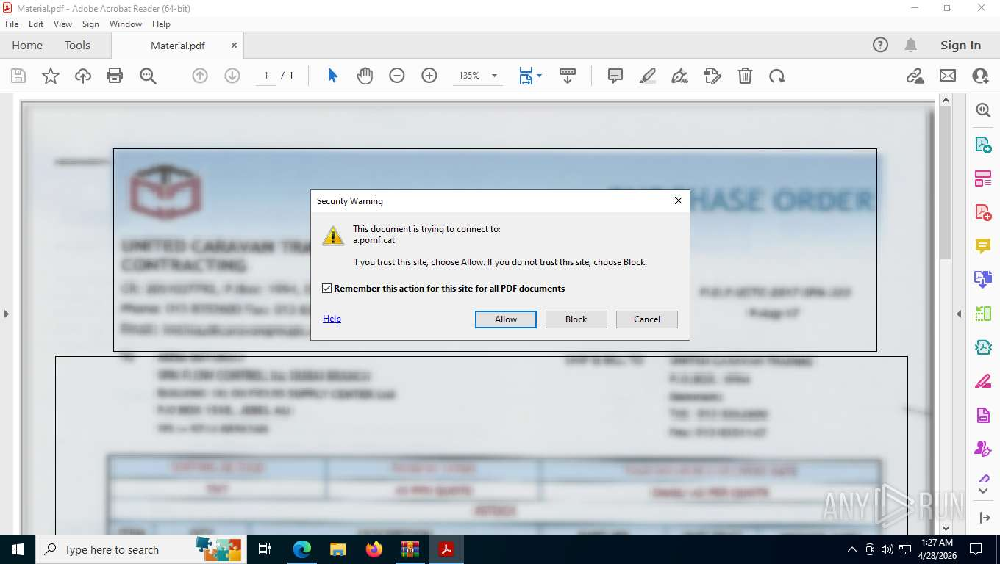
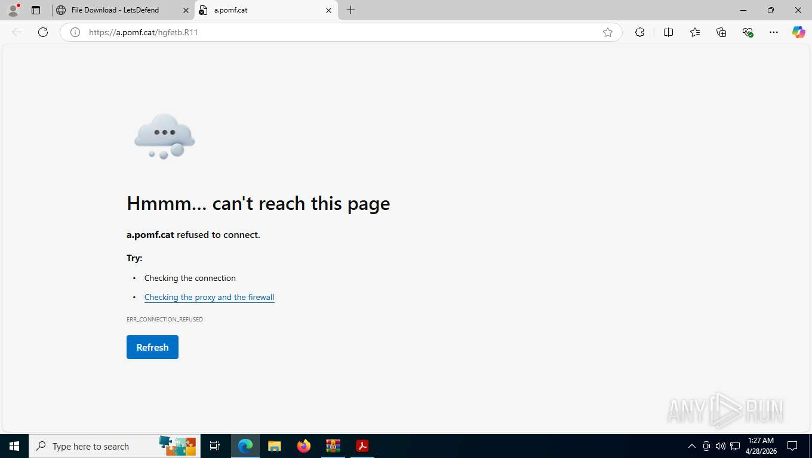

# SOC140 - Phishing Mail Detected - Suspicious Task Scheduler | Walkthrough

## Alert Details

| Field | Value |
|---|---|
| EventID | 82 |
| Rule Name | SOC140 - Phishing Mail Detected - Suspicious Task Scheduler |
| Date/Time | Mar 21, 2021, 12:26 PM |
| SMTP Address | 189.162.189.159 |
| Source Address | aaronluo@cmail.carleton.ca |
| Destination Address | mark@letsdefend.io |
| E-mail Subject | COVID19 Vaccine |
| Device Action | Blocked |
| Attachment | 72c812cf21909a48eb9cceb9e04b865d |
| URL | https://download.cyberlearn.academy/download/download?url=https://files-ld.s3.us-east-2.amazonaws.com/72c812cf21909a48eb9cceb9e04b865d.zip |

---

## Step 1 - SMTP Address Investigation

**Tool:** [WHOIS](https://www.whois.com/whois/189.162.189.159)

The first step is verifying whether the SMTP origin matches the claimed sender domain.

| Field | Value |
|---|---|
| IP | 189.162.189.159 |
| Owner | UniNet (Gestión de direccionamiento UniNet) |
| Country | Mexico |
| Expected | Canada (Carleton University) |

**Finding:** The sender claims to be from `cmail.carleton.ca`,  a legitimate Canadian university domain. However, the SMTP origin IP belongs to a Mexican ISP. This geographic mismatch confirms the sender address is **spoofed**. Legitimate Carleton University emails route through Canadian infrastructure, not Mexican.

---

## Step 2 - URL Analysis

**Tool:** VirusTotal, URLScan.io, HybridAnalysis

### VirusTotal - Delivery URL

`https://download.cyberlearn.academy/download/download?url=https://files-ld.s3.us-east-2.amazonaws.com/72c812cf21909a48eb9cceb9e04b865d.zip`

- **14/91** security vendors flagged as malicious

### URLScan.io

- Resolves to Cloudflare infrastructure (172.67.166.172)
- Short-lived TLS certificate issued March 2026
- Consistent with a purpose-built phishing delivery domain

### HybridAnalysis

- Verdict: **Malicious**

**Finding:** The delivery domain has no legitimate purpose. Payload is staged on Amazon S3 (`files-ld.s3.us-east-2`) - a deliberate technique to abuse the trusted reputation of major cloud providers and bypass URL reputation filters that whitelist them by default.

---

## Step 3 - Attachment Analysis

### 3.1 Sandbox Analysis - ANY.RUN

**Report:** https://app.any.run/tasks/7d715163-0488-4611-ac5a-3c9c71dfb513

**Verdict:** Malicious  
**Tags:** `arch-doc` `phishing` `phish-pdf` `phish-img`

Tags breakdown:
- `arch-doc` - archive (ZIP) containing a document (PDF) as the attack vehicle
- `phish-pdf` - the PDF itself is the phishing mechanism
- `phish-img` - uses images to visually deceive the victim

#### Attack Chain (Screenshot Evidence)

**Step 1 - Delivery page**

The delivery URL presents a password-gated download page asking the user to type "infected" - a social engineering gate making the victim actively participate in their own infection.



**Step 2 - Archive contents**

WinRAR shows the ZIP contains exactly one file: `Material.pdf` (358,546 bytes).  
File timestamp: **3/21/2021** - matches the alert date exactly, confirming the payload was freshly created and deployed on the day of the attack.


**Step 3 - User interaction required**

Windows presents an "How do you want to open this file?" dialog. Adobe Acrobat is selected. This confirms user interaction was required - execution is not automatic.



**Step 4 - The smoking gun**

Upon opening in Adobe Acrobat, a Security Warning dialog appears:

> *"This document is trying to connect to: a.pomf.cat - If you trust this site, choose Allow."*

The PDF's embedded `/Launch` action triggered this the moment Acrobat opened the file. The document is visually designed as a professional Purchase Order with a Mazda logo and "PURCHASE ORDER" header - purely to establish trust and convince the victim to click Allow.



**Step 5 - Phishing destination**

After clicking Allow, the browser navigates to `https://a.pomf.cat/hgfetb.R11`. The page is now down (ERR_CONNECTION_REFUSED) - phishing infrastructure is typically taken down quickly after campaigns end. ANY.RUN captured the connection while it was live.



---

#### ANY.RUN Indicators

**General Info panel flags:**
-  Network attacks were detected
-  Task contains several apps running

ANY.RUN's IDS layer (Suricata) flagged active malicious network behavior during dynamic analysis - not just a static file match. The sample *actually did something* over the network while being analyzed.

#### Behavior - INFO Events

| Behavior | Process | Analysis |
|---|---|---|
| Reads computer name | identity_helper.exe | Sandbox detection - real machines have unique hostnames |
| Reads environment values | identity_helper.exe | Reconnaissance - OS version, username, installed paths |
| Checks supported languages | identity_helper.exe | Geotargeting or sandbox detection |
| Application launched itself | msedge.exe, Acrobat.exe, AcroCEF.exe | Normal multi-process behavior but increases analysis complexity |
| Launching file from Downloads | msedge.exe | Normal - documents the delivery chain |
| Reads IE security settings | OpenWith.exe | Checks security restrictions before acting |

`identity_helper.exe` performs three separate reconnaissance actions - computer name, environment values, language settings. Individually labeled INFO, but together they indicate **systematic victim profiling**.

#### Network Connections - Malicious

| PID | Process | IP | Domain | ASN | Verdict |
|---|---|---|---|---|---|
| 7712 | msedge.exe | 3.5.89.37:443 | files-ld.s3.us-east-2.amazonaws.com | AMAZON-02 | Malicious |
| 7712 | msedge.exe | 69.39.225.3:443 | pomf.cat | ASN-GIGENET | Malicious |

- **Connection 1** - ZIP payload downloaded from Amazon S3. Attacker used AWS to abuse trusted cloud reputation and bypass firewall rules.
- **Connection 2** - PDF reached out to pomf.cat, a now-defunct anonymous file host with no content moderation, widely abused for phishing and payload staging.

#### Suricata IDS Threats

```
A Network Trojan was detected
MALWARE [ANY.RUN] Suspected Amazon CDN Associated with Malware Distribution
(files-ld.s3.us-east-2.amazonaws.com)
```

ANY.RUN's own threat intelligence team has previously flagged this specific S3 subdomain in prior malware distribution campaigns. This is not a generic rule - it is a targeted signature.

---

### 3.2 Static Analysis - VirusTotal (PDF Hash)

**File:** Material.pdf  
**SHA256:** `39fb927c32221134a423760c5d1f58bca4cbbcc87c891c79e390a22b63608eb4`  
**Detection:** 27/62 vendors - `Trojan.PDF.Fraud`  
**Cynet score:** 99/100 malicious

**VirusTotal Behavior Tags:**

| Tag | Meaning |
|---|---|
| `detect-debug-environment` | PDF checks if it's being analyzed in a sandbox or debugger - behaves cleanly if detected |
| `checks-user-input` | Waits for real human interaction before triggering - evades automated sandboxes |
| `calls-wmi` | Queries Windows Management Instrumentation to profile the system |
| `direct-cpu-clock-access` | Reads CPU timing - VMs have abnormal clock behavior, used for sandbox detection |
| `long-sleeps` | Deliberately delays execution to outlast sandbox timeout windows |
| `checks-network-adapters` | VMs use virtual adapters - real machines look different |
| `acroform` | Contains an interactive PDF form element |

These tags collectively indicate the PDF was **deliberately engineered** to evade sandbox analysis and only execute against real human victims. This is not an amateur phishing document.

**VirusTotal Code Insights:**

> The document is visually designed to appear as a high-value Purchase Order from United Caravan Trading and Contracting, using urgent language (TOP URGENT) to pressure the recipient. The extracted text layer consists of garbled characters while the visual layer remains perfectly legible - intentional **text obfuscation** to defeat email gateway OCR scanners. The PDF contains a `/Launch` action triggered through direct user interaction.

**Three Detection Layers - Triangulation:**

| Layer | Source | Finding |
|---|---|---|
| Static | VirusTotal - 27/62 vendors | Trojan.PDF.Fraud |
| Dynamic/Behavioral | ANY.RUN sandbox | Full phishing chain confirmed |
| Network/IDS | Suricata | Known malware distribution S3 bucket |

---

## Artifacts

| Type | Value | Comment |
|---|---|---|
| URL | https://download.cyberlearn.academy/...72c812cf...zip | Delivery URL |
| URL | https://a.pomf.cat/hgfetb.R11 | Phishing redirect |
| Email Sender | aaronluo@cmail.carleton.ca | Spoofed sender |
| Email Domain | cmail.carleton.ca | Spoofed domain |
| IP Address | 189.162.189.159 | Geographic mismatch |
| MD5 | 72c812cf21909a48eb9cceb9e04b865d | Malicious ZIP |
| MD5 | D15528618D3372C9F48534F7BE5CC321 | Malicious PDF |

---

## Final Analyst Comment

The delivery URL (`download.cyberlearn.academy`) was flagged malicious by 14/91 VirusTotal vendors, with Kaspersky and Sophos classifying it as phishing, and BitDefender, Fortinet, and G-Data as malware. HybridAnalysis returned a malicious verdict with VIPRE at 100% confidence. URLScan confirmed the domain is ~1 year old, hosted behind Cloudflare, with a short-lived TLS certificate - consistent with purpose-built phishing infrastructure. Payload is staged on Amazon S3 to abuse trusted cloud reputation and bypass reputation filters.

ANY.RUN sandbox confirmed the full attack chain. The ZIP contains a PDF (`Material.pdf`) which, upon opening in Acrobat, presents a Security Warning dialog socially engineering the user into connecting to `a.pomf.cat` - an anonymous file host widely abused by threat actors. The sender (`aaronluo@cmail.carleton.ca`) spoofs a legitimate Canadian university. WHOIS on the SMTP IP (`189.162.189.159`) confirms UniNet, Mexico - a geographic mismatch proving spoofing. Suricata IDS flagged the S3 subdomain as known malware distribution infrastructure.

VirusTotal analysis of the PDF (27/62 vendors, Trojan.PDF.Fraud, Cynet 99/100) reveals sandbox evasion via CPU clock checks, WMI calls, long sleeps, and network adapter enumeration - confirming a professionally crafted sample designed to evade automated analysis. Text layer is intentionally obfuscated to bypass OCR-based email gateways.

**Verdict: True Positive.** Email correctly blocked. No endpoint action required. Recommend user awareness training on COVID-themed lures and unsolicited compressed attachments.

---

## Attack Chain Summary

```
Spoofed university email (COVID19 subject)
        ↓
Delivery URL → download.cyberlearn.academy
        ↓
ZIP downloaded from Amazon S3 (files-ld bucket)
        ↓
Material.pdf extracted via WinRAR
        ↓
Adobe Acrobat opens PDF → Security Warning dialog
        ↓
User clicks Allow → browser navigates to a.pomf.cat
        ↓
Phishing destination (now offline)
```

---

*Tools used: WHOIS, ANY.RUN, VirusTotal, URLScan.io, HybridAnalysis*  
*Alert verdict: True Positive - Malicious*  
