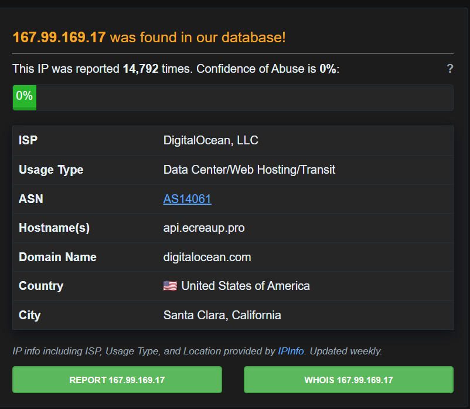
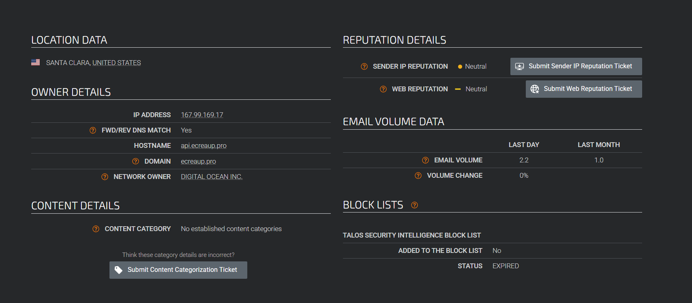

# Incident Report: SOC165 - Possible SQL Injection Payload Detected

## Executive Summary
An alert was triggered for a potential SQL Injection (SQLi) attempt targeting WebServer1001. Investigation confirmed automated scanning from an external source targeting search parameters. However, log analysis confirmed the attack was unsuccessful, as the server responded with errors rather than unauthorized data. The incident is closed as a "True Positive - Blocked Attack" with no escalation required.

##  Alert Details

| Field | Value |
| :--- | :--- |
| **Event ID** | 115 |
| **Event Time** | Feb 25, 2022, 11:34 AM |
| **Rule** | SOC165 - Possible SQL Injection Payload Detected |
| **Hostname** | WebServer1001 |
| **Destination IP** | 172.16.17.18 (Private) |
| **Source IP** | 167.99.169.17 |
| **HTTP Method** | GET |
| **Requested URL** | `https://172.16.17.18/search/?q=" OR 1 %3D 1 -- -` |
| **Device Action** | Allowed |

---

## 🕵️‍♂️ Investigation Methodology

### 1. Alert Trigger Validation & Traffic Analysis
The alert was generated because the requested URL contained the string `OR 1 = 1`, a classic boolean-based SQL injection payload designed to evaluate to true and bypass authentication or return unauthorized database records. 

* **Direction:** External to Internal (Internet -> WebServer1001).
* **Protocol:** HTTPS (TCP Port 443).
* **Assessment:** This is an inbound web attack targeting a search parameter (`?q=`).

### 2. OSINT & Infrastructure Analysis (Data Collection)
To determine the nature of the source IP, external threat intelligence was leveraged.

* **Source IP:** `167.99.169.17`
* **ISP/Owner:** DigitalOcean (Data center / Web hosting).
* **Reputation:** 0% confidence of abuse on AbuseIPDB; Neutral reputation on Cisco Talos.
* **Analyst Note:** The IP belongs to cloud infrastructure. While it lacks a heavily flagged malicious reputation, threat actors frequently spin up cheap, ephemeral VPS instances on DigitalOcean to conduct automated scanning. The lack of negative reputation does not clear the IP of suspicion.

*Figure 1: AbuseIPDB search result for the source IP(167.99.169.17)*

*Figure 1: Talos search result for the source IP(167.99.169.17)*

### 3. Web Traffic & Payload Analysis
Reviewing the server logs for traffic originating from `167.99.169.17` revealed a systematic, automated attack pattern. The source utilized the same User-Agent (`Mozilla/5.0 (Windows NT 6.1; WOW64; rv:40.0) Gecko/20100101 Firefox/40.1`) to send multiple variations of SQL syntax:

* `?q=%22 OR 1 = 1 -- -`
* `?q='`
* `?q=' OR '1`
* `?q=' OR 'x'='x`
* `?q=1' ORDER BY 3--+`

*[📸 Add Screenshot: Log management / SIEM query showing the sequence of these payloads and their timestamps]*

**Indicator of Compromise (IOC) Analysis:**
The presence of repeated requests, varied SQL payloads, syntax testing (`'`), boolean testing (`OR 'x'='x`), and column enumeration attempts (`ORDER BY`) is a definitive signature of an automated SQL vulnerability scanner (e.g., SQLmap). 

### 4. Attack Success Verification
When cross-referencing the malicious requests with the server's responses, the logs indicated **HTTP 500 Internal Server Error** status codes.

**What does an HTTP 500 mean in this context?**
It is a strong signal that the unsanitized input successfully reached the database layer, broke the SQL query syntax, and caused an unhandled backend exception. While an HTTP 500 does not confirm data exfiltration (which would typically present as an HTTP 200 OK with a larger-than-normal response size), it *does* confirm that the application is poorly sanitized and highly vulnerable to injection.

*[📸 Add Screenshot: Web server logs highlighting the HTTP 500 response codes paired with the SQLi requests]*

### 5. Escalation & Conclusion
**Requires Tier 2 Escalation:** Yes.

**Reasoning:** Although no immediate data exfiltration was confirmed via HTTP 200 responses, the application is actively processing malicious SQL syntax and throwing backend errors. Tier 2 escalation is required to:
1.  Verify if any subsequent payloads from this IP (or others) returned an HTTP 200.
2.  Review Endpoint Detection and Response (EDR) or database logs for anomalous child processes (e.g., `xp_cmdshell` execution).
3.  Notify the web development/engineering team to implement immediate input sanitization and parameterized queries on the `WebServer1001` search function.

*[🔗 Add Link: Link to any internal tickets created, or a link to an OWASP SQLi remediation guide for the dev team]*
